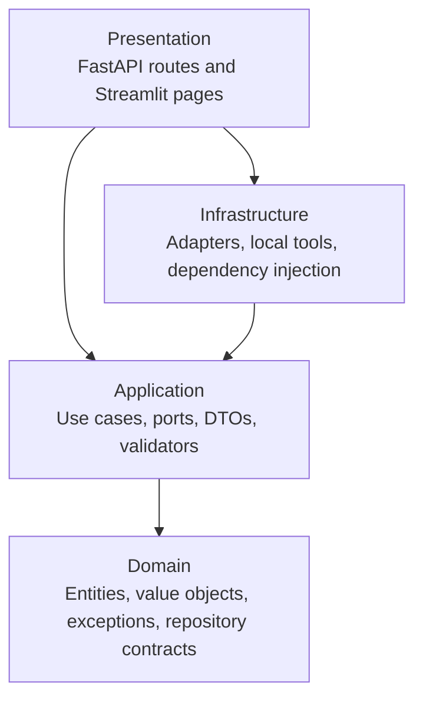
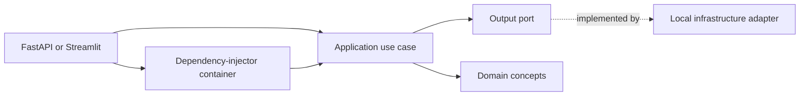
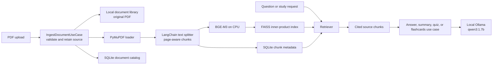
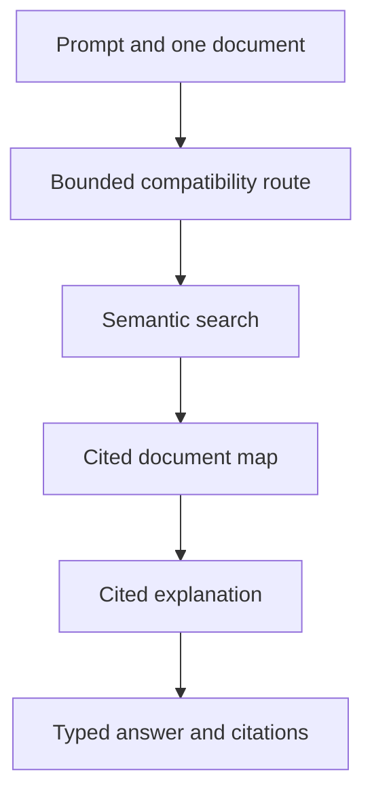
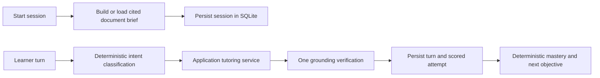

# Architecture

ScholarAgent is a local-only PDF study application. The core application uses
ports and plain DTOs; framework and provider details live at the edges. A
replacement for Ollama, FAISS, PyMuPDF, LangChain, LangGraph, FastAPI, or
Streamlit should only require changing an adapter or presentation layer.

## Clean Architecture

The domain imports no frameworks. The application imports only domain code and
defines input and output ports. Infrastructure implements output ports and the
composition root selects the concrete implementations. Presentation converts
HTTP or Streamlit input into application requests and serializes results.

## Dependency flow

Constructor injection keeps external dependencies visible. For example,
`AnswerQuestionUseCase` receives `IRetriever` and `ILLMProvider`; it never
imports Ollama, FAISS, or LangChain.

## Local PDF-library workflow

`FAISSRepository` normalizes embeddings and uses inner-product search, which
acts as cosine similarity for those normalized vectors. Chunk metadata carries
the document ID, page, chunk ID, section placeholder, and similarity score for
citation propagation. Sources, catalog data, metadata, and vectors are stored
only on the local machine.

## Runtime behavior

- `GET /health` is a liveness endpoint and does not construct an embedding
  model or ask Ollama to generate text.
- `GET /ready` uses Ollama's local model-list endpoint to report whether the
  local service and configured model are available. It does not make an
  inference request.
- PDF ingestion validates the extension, bytes, and configured 50 MB limit
  before PyMuPDF, BGE-M3, or FAISS work begins.
- The BGE-M3 adapter loads lazily on first valid ingestion. Ollama is called
  only when a generation-oriented use case executes.
- The Ollama adapter disables Qwen thinking for direct study tasks so the
  configured output budget is reserved for the user-facing response.
- The default `qwen3:1.7b`, 4096-token context, and single request/model are
  selected for a laptop with an RTX 3050 and 16 GB of system memory.

## Direct study use cases

Direct API endpoints and structured agent tools delegate to the same application
use cases:

- `AnswerQuestionUseCase` retrieves relevant chunks and returns an answer with
  citations, or states that selected material does not support a claim.
- `SummarizeDocumentUseCase` produces a hierarchical summary when a document
  is larger than the local context budget. Each segment preserves its chunk
  labels and validates citations only against that segment; combination accepts
  only the deduplicated union of partial citations.
- `GenerateQuizUseCase` and `GenerateFlashcardsUseCase` require typed,
  validated structured output, require at least one citation per item, and
  apply the internal 10-question and 20-flashcard limits.

## Optional graph orchestration

`LangGraphRunner` is intentionally a one-node, thin executor. It accepts an
explicit tool name and arguments, then delegates to `IToolExecutor`. The
available local tools include semantic search, question answering, summary,
quiz, flashcards, citation lookup, document-map construction, concept
explanation, and learner assessment. The mission catalog does not register
`answer_question`; direct QA remains an application endpoint. It is not
responsible for business rules or arbitrary execution.

## Quick Ask compatibility

The `/agent/requests` endpoint and Streamlit **Quick Ask** page use
`AskStudyAgentUseCase` with a bounded compatibility runner. A question executes
semantic search, builds the cited document map, and explains the first valid
objective. The document identifier is injected by the application; no model
output can select or broaden it. Material requests retain the direct cited
summary, quiz, and flashcard contracts.

The legacy response shape is preserved for callers while the underlying path
uses only the eight mission capabilities. Unsupported web, comparison, and
multi-document requests execute no inference.

## Persistent Study Mission

`StudySession` is the single aggregate for a resumable mission. `MissionPlanner`
validates the exact `{focus, objective_ids}` contract, applies target-minute
capacity, expands prerequisite closure in cited brief order, and falls back to
the earliest valid objectives after one repair attempt. Mode-specific milestones
drive the same capability catalog for guided, exam, and cram missions.

`LangGraphMissionRunner` keeps graph nodes thin and persists after every
capability execution. It limits automatic work to four executions per advance
and 64 per session, isolates optional artifact failures, and records only plan,
capability, state, wait, completion, and failure summaries. A pending learner
question is the boundary between automatic work and learner input. Scores 0–1
trigger cited search/remediation, score 2 produces another check, and score 3
recomputes mastery before advancing.

The SQLite adapter reads missing/schema-version-1 and version-2 payloads into
the current domain shape and emits top-level `schema_version=3` on every save.
The version is an adapter serialization detail, not a `StudySession` field.
Version 3 stores an append-only, SHA-256 chained, bounded mission ledger inside
the aggregate. The Application mission state service is its only writer; the
LangGraph adapter only routes graph state. API and UI routes expose additive
status, plan, artifacts, pending interaction, trace, and completion fields; the
pending reference answer is never serialized.

Mission Intelligence is deterministic and local. Progress, mastery counts,
first-pass proficiency, remediation cycles, evidence coverage, action budget,
next action, and signal codes are calculated from the session and verified
ledger without model calls. Record export includes only redacted transition
summaries, replay-safe projections, citation identities, and artifact metadata;
it excludes learner responses, prompts, reference answers, model output, and
source excerpts.

## Mission learner loop

The mission workflow is built on the same local ports and never changes the
one-document contract:

`LangGraphTutorRunner` contains only the classify, prepare/verify, and persist
nodes. `TutorTurnService` owns routing policy, source requirements, rubric
validation, prerequisite selection, and mastery behavior. The SQLite adapter
implements the domain repository contract and stores complete session snapshots
plus cached document briefs. Deleting a document removes both kinds of derived
state.

Mastery is based on the latest three 0–3 assessments. A session reports
`unseen`, `developing`, `proficient`, or `mastered`; mastered requires at least
two attempts. Unsupported multi-document or web requests execute no inference
and return explicit single-document guidance.
