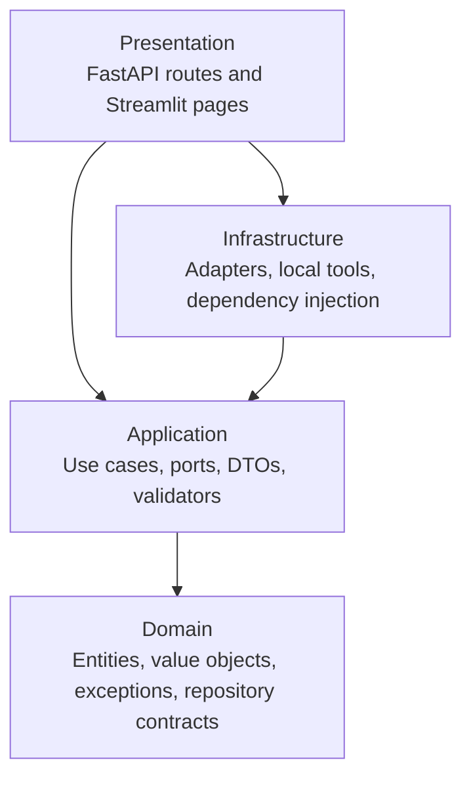
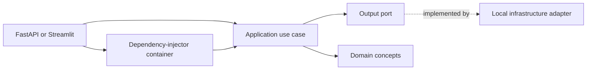
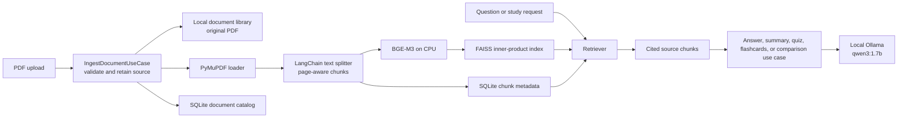
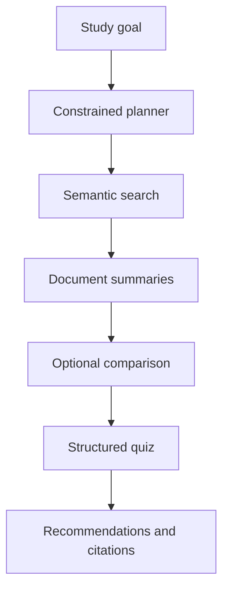

# Architecture

ScholarAgent is a local-only PDF study application. The core application uses
ports and plain DTOs; framework and provider details live at the edges. A
replacement for Ollama, FAISS, PyMuPDF, LangChain, LangGraph, FastAPI, or
Streamlit should only require changing an adapter or presentation layer.

## Clean Architecture

The domain imports no frameworks. The application imports only domain code and
defines input and output ports. Infrastructure implements output ports and the
composition root selects the concrete implementations. Presentation converts
HTTP or Streamlit input into application requests and serializes results.

## Dependency flow

Constructor injection keeps external dependencies visible. For example,
`AnswerQuestionUseCase` receives `IRetriever` and `ILLMProvider`; it never
imports Ollama, FAISS, or LangChain.

## Local PDF-library workflow

`FAISSRepository` normalizes embeddings and uses inner-product search, which
acts as cosine similarity for those normalized vectors. Chunk metadata carries
the document ID, page, chunk ID, section placeholder, and similarity score for
citation propagation. Sources, catalog data, metadata, and vectors are stored
only on the local machine.

## Runtime behavior

- `GET /health` is a liveness endpoint and does not construct an embedding
  model or ask Ollama to generate text.
- `GET /ready` uses Ollama's local model-list endpoint to report whether the
  local service and configured model are available. It does not make an
  inference request.
- PDF ingestion validates the extension, bytes, and configured 50 MB limit
  before PyMuPDF, BGE-M3, or FAISS work begins.
- The BGE-M3 adapter loads lazily on first valid ingestion. Ollama is called
  only when a generation-oriented use case executes.
- The Ollama adapter disables Qwen thinking for direct study tasks so the
  configured output budget is reserved for the user-facing response.
- The default `qwen3:1.7b`, 4096-token context, and single request/model are
  selected for a laptop with an RTX 3050 and 16 GB of system memory.

## Direct study use cases

The API and Streamlit pages call direct use cases rather than an agent:

- `AnswerQuestionUseCase` retrieves relevant chunks and returns an answer with
  citations, or states that selected material does not support a claim.
- `SummarizeDocumentUseCase` produces a hierarchical summary when a document
  is larger than the local context budget.
- `GenerateQuizUseCase` and `GenerateFlashcardsUseCase` require typed,
  validated structured output.
- `CompareDocumentsUseCase` retrieves evidence from each document separately
  and keeps citations for both sides.

## Optional graph orchestration

`LangGraphRunner` is intentionally a one-node, thin executor. It accepts an
explicit tool name and arguments, then delegates to `IToolExecutor`. The
available local tools are semantic search, summary, comparison, quiz,
flashcards, and citation lookup. It is not responsible for answer generation,
business rules, or hidden routing and is not required by the HTTP or Streamlit
flows.

## Goal-oriented study agent

The `/agent/study` endpoint and the Streamlit Study Agent page use
`PrepareStudySessionUseCase` and `LangGraphAgentRunner`. A constrained planner
creates a tool sequence from the study goal and selected documents:

The graph state records the goal, planned actions, completed tools, retrieved
citations, summaries, quiz questions, and errors. It only invokes the approved
study tools through `IToolExecutor`; it cannot invent tools or execute arbitrary
code. Tool failures are recorded so completed work can still be returned.
