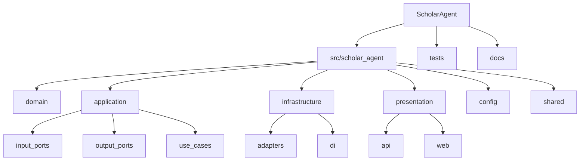

# Folder Guide

## Directory structure

| Folder | Responsibility | May depend on |
| --- | --- | --- |
| `domain` | Business concepts and repository contracts | Standard library only |
| `application` | Use cases, ports, DTOs, validators | `domain` |
| `infrastructure` | Port implementations and DI setup | `application`, `domain`, configuration |
| `presentation` | HTTP and Streamlit delivery adapters | `application`, composition root |
| `config` | Environment-backed settings | Pydantic settings |
| `shared` | Stable cross-cutting primitives | Standard library where possible |
| `tests` | Boundary-focused verification | Public package interfaces |
| `docs` | Architecture and contributor guidance | None |

Each source folder includes a short README that documents its local purpose and
dependency boundary.

