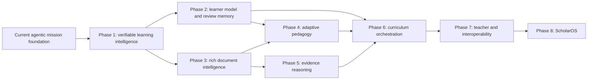

# ScholarAgent Long-Term Roadmap

## Purpose

This roadmap defines the upper ceiling of ScholarAgent and a phased route from
the current implementation to that ceiling. Repository-wide engineering rules
remain authoritative and are intentionally not repeated here.

The product direction is deliberately narrower than “a chatbot with more
commands.” ScholarAgent should become a local, evidence-verifiable learning
operating system: it should choose and explain a learning path, adapt to
demonstrated understanding, preserve a trustworthy record of its decisions,
and help a learner retain and transfer knowledge over time.

## Assessed baseline

The implementation entering this roadmap already provides:

- a retained PDF library with page-aware retrieval and deletion;
- direct cited question answering and cited study-material generation;
- an exact eight-capability mission catalog with strict document binding;
- a persistent Study Mission that plans, teaches, assesses, remediates,
  checkpoints, resumes, and completes;
- a real bounded LangGraph workflow with framework-free mission policy;
- strict structured-output repair and item-level source validation;
- guided, exam, and cram mission policies;
- local API and UI surfaces, plus a Quick Ask compatibility path;
- deterministic offline tests and optional real-provider journeys; and
- a replaceable local model path, including the ScholarGPT experiment.

This is a strong agentic foundation. The main gaps are longitudinal learning
memory, inspectable decision evidence, richer document understanding,
pedagogical calibration, curriculum-scale coordination, and outcome evaluation.

## North-star experience

A learner selects material and states a real goal such as “be ready to solve
exam problems on Friday.” ScholarAgent diagnoses prerequisite knowledge, builds
a cited plan, teaches with the most appropriate intervention, tests recall and
transfer, and revises the route when evidence shows a misconception. It explains
why each step was selected and which source passages justify it.

After the mission, ScholarAgent schedules targeted reviews, preserves a local
learner model, and can show a teacher or learner an auditable account of what
was attempted, what improved, what remains uncertain, and how those conclusions
were calculated. Over months, it coordinates document-bound missions into a
curriculum while never blurring evidence between documents.

The ceiling is reached when ScholarAgent can act for long periods without
becoming opaque: greater autonomy must produce more inspectable evidence, not
less.

## Strategic constraints for every phase

These are roadmap decisions, not restatements of general repository guidance.

1. Existing capability and evidence-scope contracts are treated as fixed public
   interfaces. New behavior is implemented behind them unless a separately
   approved governance change updates the repository instructions.
2. Raw prompts, model output, and learner responses do not enter diagnostic
   traces, analytics ledgers, or exported telemetry. Existing learner-owned
   session content remains local and is exported only through an explicit user
   action.
3. Model output may propose; deterministic code validates, bounds, scores,
   schedules, and persists.
4. Every phase must work with deterministic fakes before it is evaluated with a
   real local model. Provider availability cannot be a prerequisite for the
   ordinary test suite.
5. New automation must declare a finite work budget, a wait condition, a
   recoverable failure state, and a human-visible completion condition.
6. “Learning effectiveness” is not claimed from proxy metrics alone. Until a
   learner study exists, the UI and documentation call them learning signals.

## North-star measures

| Measure | Definition | Required direction |
| --- | --- | --- |
| Evidence integrity | Learner-facing factual units with valid selected-document citations | 100% |
| Scope isolation | Executions returning or accepting evidence from another document | 0 |
| Resume fidelity | Persisted missions that resume to the same observable state and next action | 100% |
| Decision explainability | State transitions represented by a validated, redacted ledger entry | 100% |
| Bound compliance | Advances and sessions exceeding their configured action budgets | 0 |
| Calibration | Agreement between predicted mastery and later independent checks | Improve by release |
| Retention | Previously proficient objectives still recalled after a scheduled delay | Improve by cohort |
| Transfer | Objectives passed on a novel application question, not only a repeated prompt | Improve by cohort |
| Local operability | Core workflows usable without a network after assets are cached | 100% |

The first five are release gates. Calibration, retention, and transfer become
product outcome measures once the required data exists.

---

## Phase 1 — Verifiable Learning Intelligence

### Outcome

Make every mission transition inspectable, integrity-checkable, and measurable.
The learner should be able to answer three questions from the mission screen:

1. What changed in my learning state?
2. Why did ScholarAgent choose the next step?
3. Can the stored account of this mission be verified and replayed?

This phase is the foundation for all later personalization. It must not alter
the existing execution contracts or add new model decisions.

### 1.1 Mission evidence ledger

Add immutable domain records stored inside the `StudySession` aggregate so a
state snapshot and its ledger are persisted together.

`MissionLedgerEntry` contains:

- `sequence`: contiguous integer starting at one;
- `event_type`: one of `mission_started`, `plan_created`,
  `capability_completed`, `capability_failed`, `learner_assessed`,
  `remediation_started`, `mastery_changed`, `artifact_created`,
  `waiting_for_learner`, `mission_completed`, or `mission_failed`;
- `summary`: redacted, deterministic user-facing explanation;
- optional `objective_id` and `capability`;
- validated source references, when the transition used evidence;
- an after-transition `MissionStateProjection`;
- `previous_digest` and `current_digest`; and
- `created_at`.

`MissionStateProjection` contains only replay-safe fields:

- mission status;
- active milestone identifier;
- pending objective identifier;
- action, attempt, artifact, and completed-milestone counts;
- mastery label per planned objective; and
- the identifier of the next planned milestone, if any.

The digest is SHA-256 over canonical JSON containing the previous digest,
sequence, event type, projection, objective/capability identifiers, and citation
identities. Human text, timestamps, raw responses, prompts, and model output are
excluded so the chain is deterministic and private.

Rules:

- entries are append-only;
- sequence and digest chains are validated when loading current-schema data;
- a repeated checkpoint with the same deterministic transition key is
  idempotent;
- ledger length is bounded at 512 entries per session; reaching the bound puts
  the mission into a recoverable failed state rather than silently truncating;
- the existing concise trace remains an API compatibility view and is not used
  for analytics; and
- document deletion removes its mission ledgers through the existing session
  lifecycle.

Persist this as study-session schema version 3. Continue reading version 1 and
version 2 payloads, initialize an empty verified ledger for them, and write only
version 3 after the next save. Serialization version remains adapter-owned.

### 1.2 Deterministic learning insights

Add `GetMissionInsightsUseCase`. It computes a `MissionInsights` DTO from the
session and verified ledger without invoking a model.

Required fields and definitions:

- `progress_percent`: completed milestones divided by total milestones;
- `mastery_counts`: count of planned objectives in each existing mastery label;
- `assessment_count`: total scored learner attempts;
- `first_pass_proficiency_rate`: objectives whose first score is at least two,
  divided by objectives with an assessment;
- `remediation_cycles`: number of `remediation_started` entries;
- `evidence_coverage`: completed evidence-requiring milestones carrying at
  least one citation, divided by completed evidence-requiring milestones;
- `action_budget_used` and `action_budget_remaining`;
- `ledger_verified`: result of full sequence/digest validation;
- `next_action`: a deterministic explanation derived from pending interaction,
  next milestone, mastery, and remaining budget; and
- `signals`: zero or more stable signal codes such as `needs_remediation`,
  `unassessed_objectives`, `low_evidence_coverage`, `near_action_limit`, and
  `mission_complete`.

Division-by-zero results are `null`, not zero. Insight computation must be a
pure function over current state.

Add `VerifyMissionLedgerUseCase` and `ExportMissionRecordUseCase`. Verification
returns the first broken sequence/digest with an actionable reason. Export
returns a versioned JSON document containing session identity, plan, redacted
ledger, insights, citation identities, and artifact metadata. It excludes raw
learner responses, reference answers, prompts, model outputs, and full PDF text.

### 1.3 Integration points

The Application mission state/checkpoint service is the single ledger writer.
Every persisted mission transition must pass through it. The LangGraph adapter
continues to contain only graph state, nodes, and routes; it does not construct
ledger entries or calculate insights.

New presentation endpoints:

- `GET /agent/sessions/{session_id}/insights`
- `GET /agent/sessions/{session_id}/record`
- `POST /agent/sessions/{session_id}/record/verify`

The Study Mission UI adds a compact **Mission Intelligence** panel containing:

- progress and action-budget indicators;
- mastery distribution;
- first-pass and remediation signals when defined;
- “Why this is next” text;
- evidence coverage;
- ledger verification status; and
- an expandable redacted decision timeline.

The panel must be understandable without exposing internal graph terminology.

### 1.4 Offline mission evaluator

Add `scripts/evaluate_missions.py`. It runs deterministic scenarios through the
real application and graph composition with fake tools/providers, then writes a
versioned JSON report under `data/evaluation/`.

Required scenarios:

1. guided mission with first-pass proficiency;
2. low score followed by cited remediation and recovery;
3. optional artifact failure followed by successful continuation;
4. process-style save/reload/resume;
5. explicit completion before all milestones;
6. action-budget failure at the session limit;
7. legacy version-2 session upgrade; and
8. tampered ledger detection.

Report metrics include evidence integrity, document isolation, resume fidelity,
ledger verification, bound compliance, transition counts, and scenario result.
The script exits non-zero if any release-gate measure fails.

### 1.5 Phase 1 acceptance gate

Phase 1 is complete only when all of the following hold:

- every mission persistence path emits an appropriate ledger entry or proves it
  is a read-only operation;
- repeated saves do not duplicate a transition;
- ledger verification survives a repository close/reopen cycle;
- a modified historical entry is detected on load or explicit verification;
- schema versions 1, 2, and 3 read successfully and the next save writes
  version 4 with an optional profile association;
- insights are identical before and after reload;
- record export contains none of the forbidden raw fields;
- API and UI tests cover the intelligence panel and all three endpoints;
- the existing capability and evidence-scope regression tests remain unchanged;
- all eight evaluator scenarios pass; and
- the complete configured quality gate passes.

### Phase 1 implementation record

The Phase 1 implementation uses an adapter-owned schema-3 write path with
version-1/version-2 reads, an append-only 512-entry chained ledger, deterministic
Mission Intelligence, three additive record endpoints, and the local redacted
export. The offline evaluator passes all eight scenarios and all five release
gates in `data/evaluation/mission_phase1_report.json`. This record deliberately
does not introduce learner profiles, review scheduling, cross-session
aggregation, new capabilities, cloud telemetry, or generation-prompt changes.

Explicit non-goals: user profiles, spaced repetition, new mastery formulas,
cross-session aggregation, new agent capabilities, cloud telemetry, and changes
to model prompts. Those begin in later phases.

---

## Phase 2 — Durable Learner Model and Review Memory

### Outcome

Turn isolated mission results into a private longitudinal learner model. The
system should remember demonstrated knowledge, uncertainty, and review timing
without letting stale confidence silently control a new mission.

### Scope

- Introduce a local learner profile selected explicitly in the UI; no account is
  required for the default single-user profile.
- Define stable `ConceptFingerprint` values from normalized document-local
  concept descriptors. Cross-document equivalence is proposed by a model but
  accepted only through deterministic similarity thresholds or user review.
- Store evidence observations rather than a mutable global “mastery score.” An
  observation records assessment type, score, difficulty, support citations,
  timestamp, and whether the question tested recall or transfer.
- Add a deterministic knowledge-tracing policy that produces confidence and
  uncertainty from observations. Keep the existing mission mastery labels as a
  compatibility projection.
- Add a review scheduler using retrieval strength, target date, and uncertainty.
  It schedules a new one-document mission; it never invokes a tool across
  documents.
- Add `GetReviewQueueUseCase`, `RecordReviewOutcomeUseCase`, and profile
  import/export/deletion use cases.
- Add a Today/Review UI with due concepts, reason, source document, expected
  duration, and a “start document-bound review mission” action.

### Exit gate

- Profile deletion is complete and testable.
- Review schedules are deterministic for a fixed clock.
- A learner can export and restore the profile without changing concept history.
- Confidence decays when review evidence becomes stale.
- Transfer checks affect confidence more than repeated recall checks, with the
  weighting documented and tested.
- No profile operation broadens a capability execution beyond one document.

### Phase 2 implementation record

Phase 2 is implemented as a local, profile-scoped learner model. New study
sessions optionally persist a learner-profile association in schema version 4;
older session payloads remain readable and detached. Redacted evidence
observations feed deterministic confidence, uncertainty, decay, and review
scheduling without storing learner responses, prompts, model output, reference
answers, or source excerpts. Cross-document concept equivalence is
consent-gated: proposals and rejections do not pool history, while accepted
links preserve source-document provenance.

Mission assessments write idempotent observations through the central
application checkpoint path, and review missions resolve one document and one
objective. The Today view, profile management, import/export, deletion, API
routes, and deterministic review evaluator are included. Profile deletion
cascades local learner data and detaches sessions; legacy equivalence rows are
reconciled or dropped safely when ownership is ambiguous. The Phase 2
evaluator covers nine scenarios and eight release gates, including privacy,
determinism, decay, weighting, round trips, deletion, consent, and document
isolation.

Phase 3+ work remains deferred: rich document structure and OCR, new
capabilities, adaptive pedagogy, evidence reasoning, curriculum orchestration,
teacher/interoperability features, authentication, remote accounts, cloud
telemetry, notifications, and generation-prompt changes.

---

## Phase 3 — Rich Document Intelligence

### Outcome

Understand the instructional structure of difficult PDFs, including layouts,
tables, figures, equations, definitions, examples, and prerequisite relations.

### Scope

- Replace the flat extraction result with a versioned `DocumentStructure` made
  of sections, blocks, reading order, and typed content roles.
- Add adapters for layout extraction and optional OCR behind existing ingestion
  ports. A text-only fallback remains fully supported.
- Preserve page bounding boxes and figure/table identifiers in citation
  metadata, while retaining existing page/chunk citations for compatibility.
- Enrich `build_document_map` to return concept, prerequisite, example, formula,
  and misconception relations from the selected document.
- Let `semantic_search` blend dense retrieval with section, role, and lexical
  signals using deterministic rank fusion.
- Let explanations and assessments use figures, tables, and equations through
  the existing capabilities; do not add model-selectable tool names.
- Add extraction diagnostics that show unreadable pages, OCR confidence, lost
  tables, and citation coverage before a mission begins.

### Exit gate

- A committed evaluation fixture covers multi-column text, one table, one
  figure, and one equation.
- Reading order and source bounding boxes meet fixture expectations.
- Retrieval improves or matches the existing corpus while preserving all old
  citations.
- Text-only environments still ingest and study the same documents.
- The UI visibly distinguishes extracted evidence from inferred relations.

---

## Phase 4 — Adaptive Pedagogy Engine

### Outcome

Select teaching strategies based on observed learning needs rather than only
mission mode and score thresholds.

### Scope

- Define a small, explicit strategy catalog: worked example, Socratic prompt,
  analogy, contrast case, retrieval practice, misconception repair, fading
  scaffold, and transfer challenge.
- Add a framework-free pedagogical policy that chooses a strategy from learner
  observations, objective type, remaining time, prior attempts, and uncertainty.
- Extend document-map objectives with knowledge type: fact, concept, procedure,
  principle, or metacognitive strategy.
- Add difficulty and cognitive-demand labels to generated questions. Validate
  them against deterministic constraints and cited evidence.
- Support interleaving within the selected document and progressive scaffold
  removal across attempts.
- Add learner controls for pace, explanation density, challenge, and preferred
  interaction style. Preferences influence policy but never override evidence
  or safety bounds.
- Run A/B-compatible local evaluations comparing policies without collecting
  telemetry remotely.

### Exit gate

- Every strategy selection has a ledger reason and a deterministic fallback.
- Golden scenarios cover at least two appropriate and two inappropriate uses of
  each strategy.
- Replaying the same state and clock chooses the same strategy.
- A later transfer question is used to calibrate whether an intervention worked.
- UI language clearly separates observed performance from inferred preference.

---

## Phase 5 — Research-Grade Evidence Reasoning

### Outcome

Make ScholarAgent trustworthy on dense academic material by representing claims,
support, uncertainty, and internal disagreement rather than merely attaching
citations after generation.

### Scope

- Build a selected-document claim-evidence graph from cited chunks through the
  existing document-map and search capabilities.
- Classify support as direct, inferential, example, definition, counterexample,
  or conflicting.
- Require explanation, summary, quiz, and assessment outputs to declare the
  claims they rely on; validate that every claim maps to sufficient evidence.
- Detect contradictions and terminology drift inside one document and present
  them as unresolved source tensions, not model conclusions.
- Add calibrated abstention policies when evidence is incomplete or ambiguous.
- Add citation sufficiency, entailment, and contradiction evaluation corpora.
- Expose a learner-friendly “evidence path” from an answer to claim to source
  location.

### Exit gate

- Unsupported claims fail closed after one repair.
- Contradictory fixtures surface both cited sides without choosing one silently.
- Citation correctness and citation sufficiency are reported separately.
- Assessment feedback cannot penalize a learner for a claim the selected
  document does not support.

---

## Phase 6 — Curriculum Orchestration Across the Library

### Outcome

Coordinate long-term goals across several documents while preserving the strict
one-document boundary of every mission and capability execution.

### Scope

- Add a non-agent `Curriculum` aggregate containing a goal, ordered
  document-bound mission references, prerequisites, target date, and completion
  policy.
- Build a coordinator that chooses which existing document should host the next
  mission. It may inspect catalog metadata and learner-profile summaries, but it
  cannot invoke study capabilities or combine evidence scopes.
- Require the user to confirm ambiguous document-to-goal mappings.
- Add curriculum pause, resume, replan, and archive operations.
- Add review scheduling and workload balancing across independent missions.
- Present a cross-library progress view whose evidence links always open the
  original single-document mission.

### Exit gate

- Coordinator tests prove that each dispatched mission has exactly one document.
- No curriculum response presents a factual synthesis across documents.
- Replanning preserves completed mission evidence and explains every changed
  dependency.
- A curriculum remains resumable after any individual mission failure.

---

## Phase 7 — Teacher, Authoring, and Interoperability Workflows

### Outcome

Let educators shape and inspect learning experiences without turning ScholarAgent
into an opaque content generator.

### Scope

- Add teacher-authored objectives, prerequisite overrides, rubrics, forbidden
  misconceptions, and exemplar responses as versioned overlays on one document.
- Add assignment and study-pack export using open, documented JSON plus common
  human-readable formats.
- Add a review queue for generated quiz items and explanations with accept,
  revise, and reject decisions.
- Add cohort views only behind an optional adapter. The default remains local
  and single-user; aggregation must suppress raw learner responses.
- Add accessibility checks for generated materials and keyboard-first UI flows.
- Add import adapters for external flashcard and learning-management formats,
  with domain-owned neutral DTOs.

### Exit gate

- Teacher overlays are auditable and never mutate extracted source evidence.
- Export/import round trips preserve objectives, citations, and rubric versions.
- Generated content is never marked teacher-approved without an explicit action.
- Cohort aggregates cannot reveal a learner response or source document content.

---

## Phase 8 — ScholarOS: The Upper Ceiling

### Outcome

Deliver a dependable autonomous learning environment that can manage a
months-long goal while staying local, bounded, evidence-verifiable, and under
learner control.

### Capabilities at the ceiling

- Goal decomposition into curricula and document-bound missions.
- Continuous diagnosis of knowledge, uncertainty, retention, and transfer.
- Adaptive selection of pedagogy, difficulty, spacing, and review timing.
- Rich understanding of text, figures, tables, equations, and document
  structure.
- Claim-level evidence paths and calibrated abstention.
- Proactive but permissioned review reminders and workload replanning.
- Learner and teacher views over the same verified evidence record.
- Full local export, deletion, migration, and provider replacement.
- Counterfactual explanations such as “this review was scheduled because the
  transfer check failed, even though recall was proficient.”
- Simulation and evaluation tools that can replay policies against fixed learner
  scenarios before those policies reach a real learner.

ScholarOS is not a free-running general assistant. Its autonomy is the ability
to sustain a learning goal through verified, finite educational decisions.

### Ceiling gate

The system may be called ScholarOS only when:

- every autonomous decision is represented in the verified ledger;
- every factual teaching claim has a selected-document evidence path;
- long-horizon replanning cannot erase or rewrite prior evidence;
- learner models expose uncertainty and support complete export/deletion;
- policy changes are evaluated against fixed regression cohorts;
- a learner can pause, inspect, override, or end any active curriculum; and
- measured retention and transfer improve in a documented learner study.

---

## Phase dependency map

Phases 2 and 3 may proceed in parallel only after Phase 1 data contracts are
stable. Phase 4 needs both. Phase 5 may begin after Phase 3. Curriculum work is
deferred until learning state, pedagogy, and evidence can be trusted.

## Delivery policy

Each phase is delivered through small vertical slices, not layer-by-layer bulk
construction. A slice includes the domain/application contract, one adapter,
one presentation path, deterministic tests, documentation, and a rollback or
migration path.

For every phase:

1. Record an Architecture Decision Record for new persisted schemas or policy
   formulas.
2. Commit deterministic fixtures before tuning behavior against them.
3. Preserve read compatibility for all existing persisted schema versions or
   provide an explicit offline migration command.
4. Put new policies behind configuration until their evaluator is green.
5. Compare real-provider behavior only after fake-provider contract tests pass.
6. Update the roadmap with measured results and newly discovered constraints;
   do not mark work complete from implementation alone.

## Immediate Phase 1 implementation order

This is the handoff sequence for the next implementation session.

1. **Contracts and migration**
   - Add ledger event/projection types and canonical digest functions.
   - Add the bounded ledger to `StudySession`.
   - Implement version-1/version-2/version-3 reads and version-4 writes with
     an optional learner-profile association.
   - Test canonicalization, chain validation, tamper detection, idempotency, and
     migration before changing the runner.
2. **Application integration**
   - Add a focused ledger service and integrate it only through the central
     mission state/checkpoint service.
   - Prove every mutating graph route produces the intended event.
   - Keep the graph adapter free of ledger construction.
3. **Insights and export**
   - Implement pure insight calculation, verification, and redacted export use
     cases.
   - Test every formula, undefined denominator, signal code, and forbidden
     export field.
4. **API and UI**
   - Add the three additive endpoints and the Mission Intelligence panel.
   - Add OpenAPI, API journey, serialization, and fresh-process UI tests.
5. **Evaluator and documentation**
   - Implement all eight deterministic scenarios and the versioned report.
   - Document metric definitions, limitations, and how to run the evaluator.
6. **Acceptance**
   - Run focused tests after each batch and the complete repository gate at the
     end.
   - Do not begin Phase 2 in the same change set.

## Principal risks and responses

| Risk | Response |
| --- | --- |
| Analytics becomes surveillance | Keep it local, redacted, explicit, exportable, and deletable; collect no remote telemetry by default. |
| A learner model hardens an early mistake | Store observations and uncertainty; decay confidence; require later checks. |
| Rich extraction silently corrupts reading order | Preserve text fallback, extraction diagnostics, and committed layout fixtures. |
| Pedagogical policy becomes prompt folklore | Encode strategy selection and fallbacks in deterministic policy with golden scenarios. |
| Cross-library planning leaks evidence | Coordinator schedules independent missions and never calls study capabilities. |
| Event history grows without bound | Bound Phase 1 ledger entries and archive only through an explicit later schema. |
| Proxy metrics are mistaken for outcomes | Label them learning signals until retention/transfer studies exist. |
| Local hardware cannot sustain richer workflows | Measure per-capability cost, use cached structure, and keep work budgets visible. |

## Roadmap completion definition

The roadmap is successful when ScholarAgent is not merely more autonomous, but
more accountable as autonomy increases. A future maintainer should be able to
replay a learning decision, verify its evidence, explain its policy, and test
its educational effect without relying on hidden model behavior.
